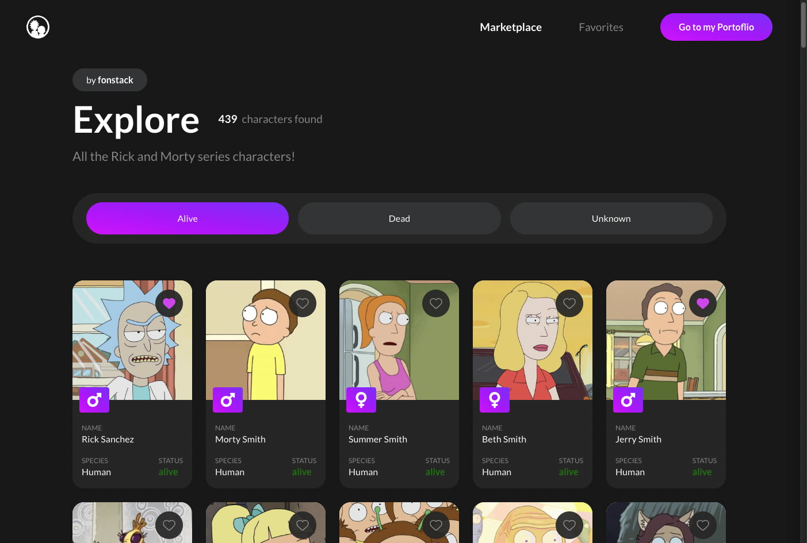
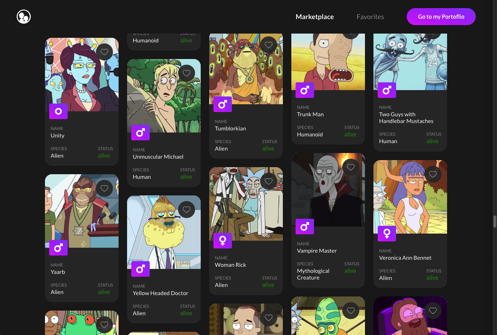

# Rick and Morty Marketplace

***Rick and Morty marketplace***. You can take a look at all the characters from the Rick and Morty series on a infinite loading and virtualized list, with a 'gallery' styles like in Pinterest (Masonry). You can save them as favorite and then you can take a look at your favorite characters. The app was developed using React, with Typescript of course ＼(°o°)／

## Libraries stack
* ***Jest*** and ***React Testing library*** for testing hooks, components and pages.
* ***MSW*** for mocking the requests used on tests.
* ***React query*** for managing all the requests and caching them.
* ***Graphql Request*** for making the requests to the [Rick and Morty API.](https://rickandmortyapi.com/)
* ***Recoil*** for global state management.
* ***Styled Components*** for styling all the components and pages.
* ***Masonic*** for virtualized list.

## App features
* ***Infinite loading***: You can see all the characters from the Rick and Morty series without getting all at once.
* ***Masonry View***: All the characters are displayed on a Masonry view, like the one in Pinterest.
* ***Virtualized list***: Having lot of characters in the dom is a big performance issue. This app implements list virtualization for only rendering at once a section of the characters.
* ***Filtering by status***: You can filter your search based on the status of the character (Alive, Dead or Unknown).
* ***Fav characters saved on global state***: The characters you saved as favorite will be saved on the global state of the app using recoil. If you refresh the page, the state is deleted. You start with three characters saved as favorite. Other option was saving them on local storage, but it would turn useless using global state.

## Deployment
The app is deployed using netlify (using CD). You can run the app locally with a simple `npm start` or check the app on the [Netlify website.](https://rickandmorty-marketplace.netlify.app/)

